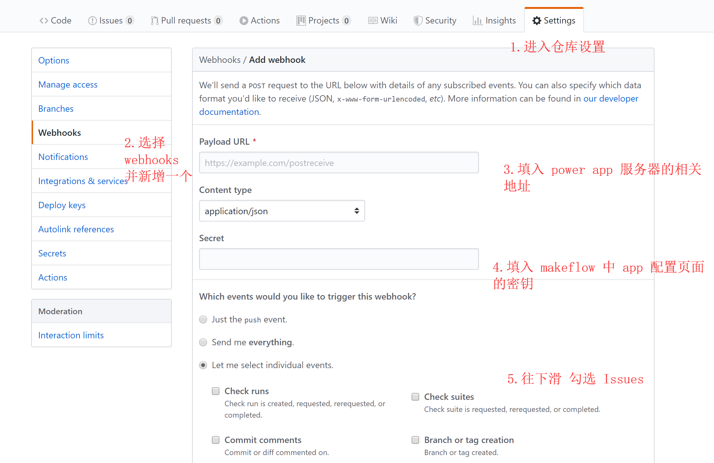

## GitHubIssue

#### 将仓库新提的 issue 创建为 makeflow 的任务

keywords: `installation` `createTask` `getContextIterable`

### 使用

#### 1.前往 GitHub 仓库中添加 WebHooks

**注意:** 第三步填入的 url

- 需公网能访问，本地开发环境需要内网穿透 [ngrok](https://ngrok.com/docs)
- 示例代码中的路径为 `/git`，所以 url 应是 `http://xxxx.xxx/git`

#### 2.将应用发布到 makeflow 并安装

#### 3.启动服务

启动当前目录下的 `app.js`

#### 4.查看效果

在仓库中创建 issue

makeflow 中创建的任务

