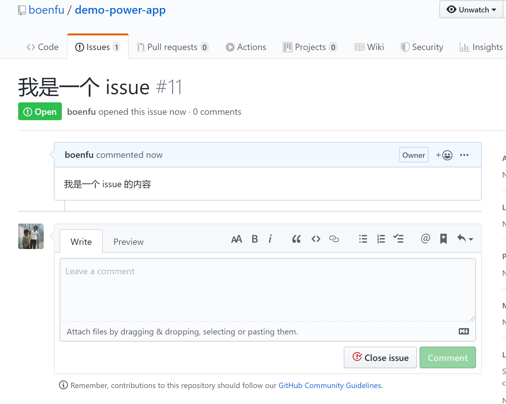

# Makeflow 示例应用

:tada::tada::tada: 持续更新中 :tada::tada::tada:

## 目录

> 点击对应链接查看详情

- 流程项
  - [财务金额数字转大写](https://github.com/boenfu/demo-power-app/tree/master/ChineseNumerals)
  - [确认文档已阅读工具](https://github.com/boenfu/demo-power-app/tree/master/ReadMe)
- 概览
  - 图表类
    - [迭代燃尽图](https://github.com/boenfu/demo-power-app/tree/master/BurnDownChart)
    - [任务完成比例饼图](https://github.com/boenfu/demo-power-app/tree/master/TaskRatioPieChart)
- 其他
  - [GitHub Issue 同步](https://github.com/boenfu/demo-power-app/tree/master/GitHubIssue)
  - [每日日报助手](https://github.com/boenfu/demo-power-app/tree/master/WorkDay)
  - [应用数据统计](https://github.com/boenfu/demo-power-app/tree/master/InstallationStatistics)

---

## 部分使用截图

### 财务金额数字转大写

---

### 确认文档阅读

---

### 迭代燃尽图

---

### 任务完成比例饼图

---

### GitHub Issue 同步

---

### 每日日报助手

---

### 应用使用统计

power by [makeflow](https://makeflow.com) - [boen](https://github.com/boenfu)
