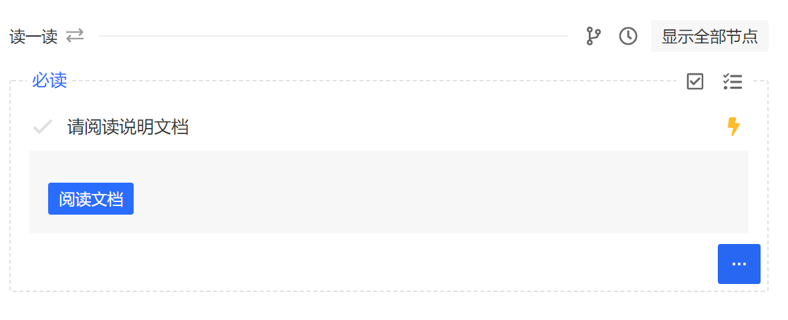
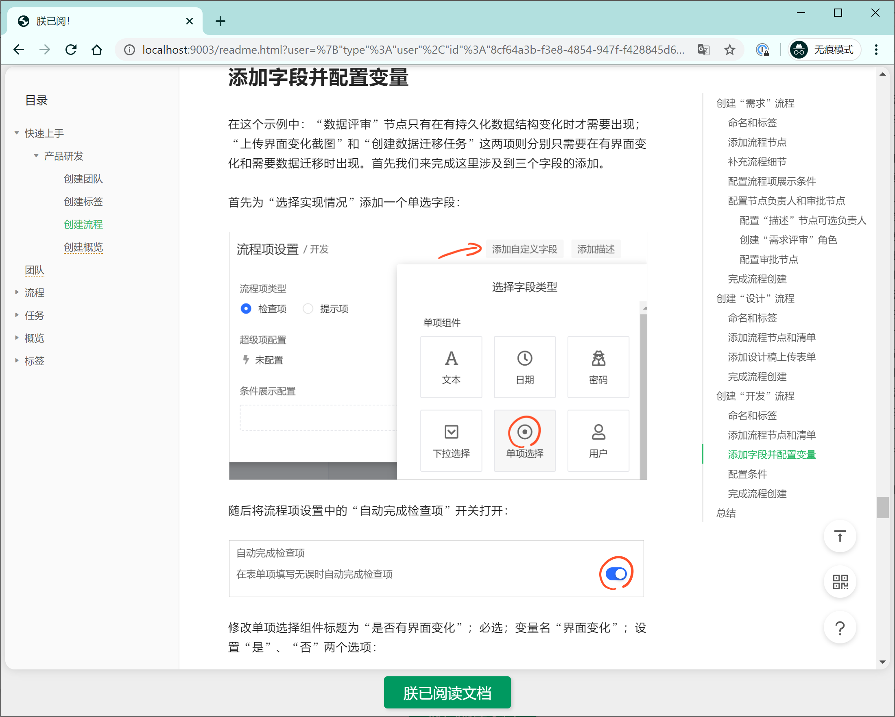
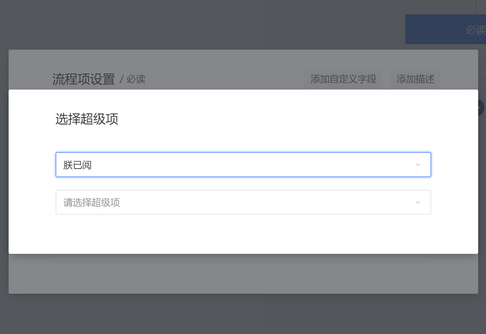
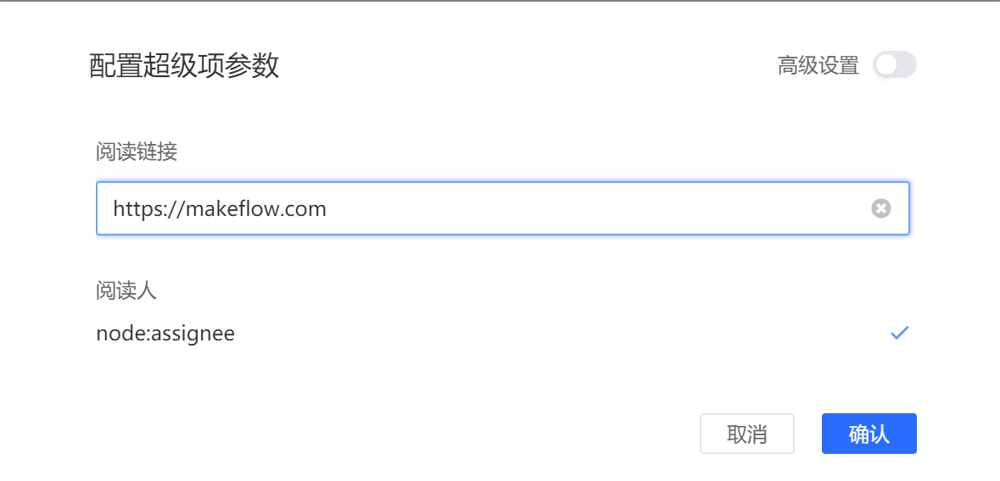

## ReadMe

#### 朕已阅 - 确认文档阅读功能

keywords: `powerItem` `updatePowerItem` `getContextIterable` `action:target`

### 使用

#### 1.将应用发布到 makeflow 并安装

#### 2.启动服务

启动当前目录下的 `app.js`

#### 3.给流程的流程项配置超级项

#### 4.创建对应流程的任务即可使用
