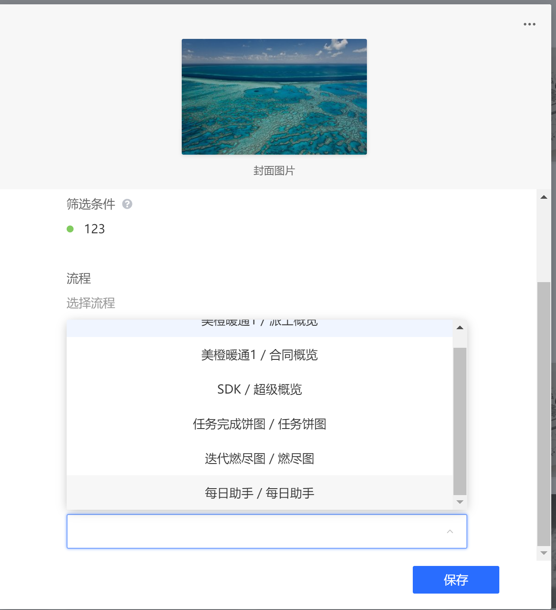
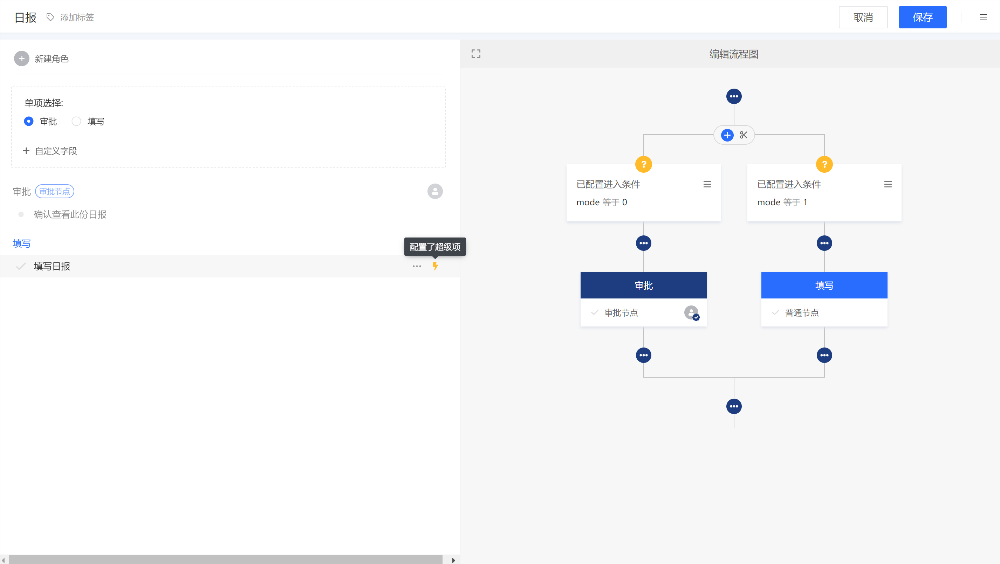
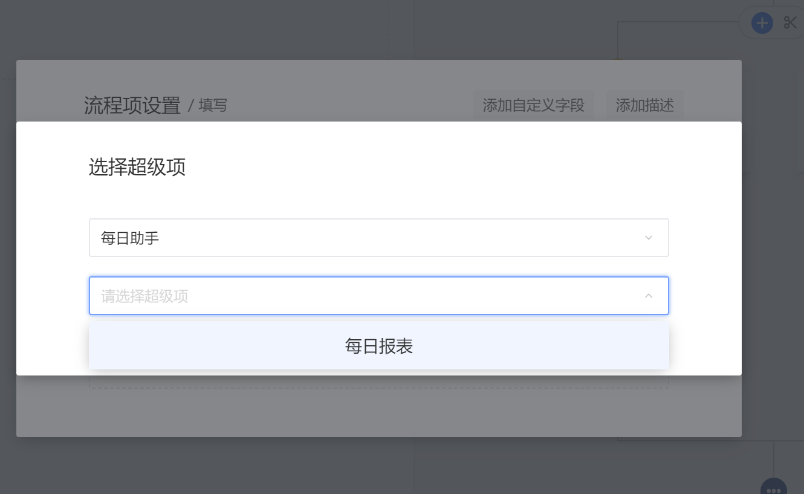

## WorkDay

#### 每日日报助手

keywords: `powerGlance` `powerItem` `action` `createTask` `getContextIterable`

创建后:

### 使用

#### 1.将应用发布到 makeflow 并安装

#### 2.启动服务

启动当前目录下的 `app.js`

#### 3.给需要监听任务的概览添加此超级概览

#### 4.创建或导入一个简单日报流程

[日报流程](./日报.mfp)

然后配置上应用提供的超级项

#### 5.创建任务后执行超级项生成日报
